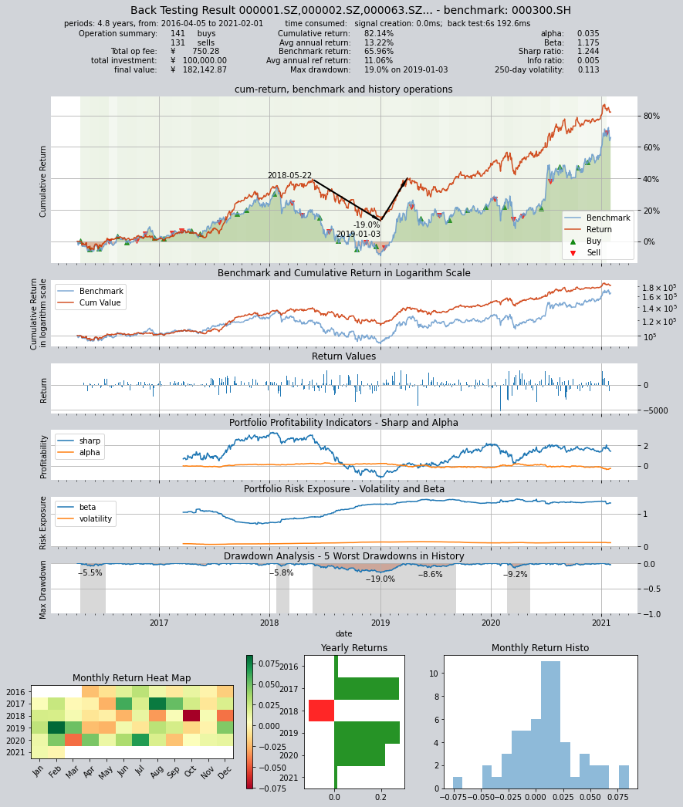
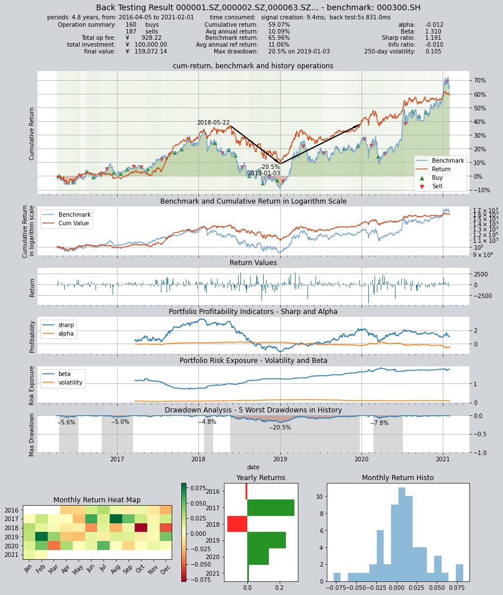

# Alpha选股交易策略

本策略每隔1个月定时触发计算SHSE.000300成份股的过去的EV/EBITDA并选取EV/EBITDA大于0的股票，随后平掉排名EV/EBITDA不在最小的30的股票持仓并等权购买EV/EBITDA最小排名在前30的股票

回测数据为:SHSE.000300沪深300指数成份股

回测时间为:2016-04-05 到 2021-02-01


```python
import qteasy as qt
import pandas as pdd
import numpy as np
```

在选股之前，需要检查需要的历史数据

EV/EBITDA数据并不直接存在于qteasy定义的数据类型中，需要通过几个数据组合计算出来

EV/EBITDA = (Market Capitalization + Total Debt - Total Cash) / EBITDA

上面几个数据分别代表总市值、总负债、总现金及现金等价物，这些数据需要从qteasy内置的数据类型中分别提取，并使用上面的公式计算后，作为选股因子。排除掉小于0的因子后，将所有选股因子从小到大排列，选出因子排在最前的30支股票，将手中的全部资金平均分配投入到所有选中的股票中持有一个月，直到下一次选股为止。

我们可以通过下面的方法检查数据检查结果。

```python
htypes = 'total_mv, total_liab, c_cash_equ_end_period, ebitda'
shares = qt.filter_stock_codes(index='000300.SH', date='20220131')
print(shares[0:10])
dt = qt.get_history_data(htypes, shares=shares, asset_type='any', freq='m')

one_share = shares[24]

df = dt[one_share]

df['ev_to_ebitda'] = (df.total_mv + df.total_liab - df.c_cash_equ_end_period) / df.ebitda

```
输出结果如下


    ['000001.SZ', '000002.SZ', '000063.SZ', '000066.SZ', '000069.SZ', '000100.SZ', '000157.SZ', '000166.SZ', '000301.SZ', '000333.SZ']

有了上面的数据定义，我们就可以创建这样的选股策略了。

实际上，我们可以使用好几种不同的方法实现同样的选股策略：


## 第一种自定义策略设置方法，使用持仓数据和选股数据直接生成比例交易信号PS信号：
使用GeneralStrategy策略类，计算选股因子后，去掉所有小于零的因子，排序后提取排名前三十的股票
按以下逻辑生成交易信号：
1，检查当前持仓，如果持仓的股票不在选中的30个中间，则全数卖出
2，检查当前持仓，如果新选中的股票没有持仓，则等权买入新增选中的股票

设置交易信号类型为PS，生成交易信号
由于生成交易信号需要用到持仓数据，因此不能使用批量生成模式，只能使用realtime模式

策略的定义如下

```python

class AlphaPS(qt.GeneralStg):
    
    def realize(self, h, r=None, t=None, pars=None):

        # 从历史数据编码中读取四种历史数据的最新数值
        total_mv = h[:, -1, 0]  # 总市值
        total_liab = h[:, -1, 1]  # 总负债
        cash_equ = h[:, -1, 2]  # 现金及现金等价物总额
        ebitda = h[:, -1, 3]  # ebitda，息税折旧摊销前利润
        
        # 从持仓数据中读取当前的持仓数量，并找到持仓股序号
        own_amounts = t[:, 0]
        owned = np.where(own_amounts > 0)[0]  # 所有持仓股的序号
        not_owned = np.where(own_amounts == 0)[0]  # 所有未持仓的股票序号
        
        # 选股因子为EV/EBIDTA，使用下面公式计算
        factors = (total_mv + total_liab - cash_equ) / ebitda
        # 处理交易信号，将所有小于0的因子变为NaN
        factors = np.where(factors < 0, np.nan, factors)
        # 选出数值最小的30个股票的序号
        arg_partitioned = factors.argpartition(30)
        selected = arg_partitioned[:30]  # 被选中的30个股票的序号
        not_selected = arg_partitioned[30:]  # 未被选中的其他股票的序号（包括因子为NaN的股票）
        
        # 开始生成交易信号
        signal = np.zeros_like(factors)
        # 如果持仓为正，且未被选中，生成全仓卖出交易信号
        own_but_not_selected = np.intersect1d(owned, not_selected)
        signal[own_but_not_selected] = -1  # 在PS信号模式下 -1 代表全仓卖出
        
        # 如果持仓为零，且被选中，生成全仓买入交易信号
        selected_but_not_own = np.intersect1d(not_owned, selected)
        signal[selected_but_not_own] = 0.0333  # 在PS信号模式下，+1 代表全仓买进 （如果多只股票均同时全仓买进，则会根据资金总量平均分配资金）
    
        return signal
```
创建一个Operator对象，并运行这个策略。

由于策略使用了当前持仓数据，因此只能使用stepwise模式回测

```python
alpha = AlphaPS(pars=(),
                 par_count=0,
                 par_types=[],
                 par_range=[],
                 name='AlphaPS',
                 description='本策略每隔1个月定时触发计算SHSE.000300成份股的过去的EV/EBITDA并选取EV/EBITDA大于0的股票',
                 data_types='total_mv, total_liab, c_cash_equ_end_period, ebitda',
                 strategy_run_freq='m',
                 data_freq='d',
                 window_length=100)  
op = qt.Operator(alpha, signal_type='PS')
op.op_type = 'stepwise'
op.run(mode=1,
       asset_type='E',
       asset_pool=shares,
       trade_batch_size=100,
       sell_batch_size=1,
       trade_log=True)

```
输出结果如下：

    
         ====================================
         |                                  |
         |       BACK TESTING RESULT        |
         |                                  |
         ====================================
    
    qteasy running mode: 1 - History back testing
    time consumption for operate signal creation: 0.0ms
    time consumption for operation back looping:  6s 192.6ms
    
    investment starts on      2016-04-05 00:00:00
    ends on                   2021-02-01 00:00:00
    Total looped periods:     4.8 years.
    
    -------------operation summary:------------
    Only non-empty shares are displayed, call 
    "loop_result["oper_count"]" for complete operation summary
    
              Sell Cnt Buy Cnt Total Long pct Short pct Empty pct
    000301.SZ    1        1      2    10.3%      0.0%     89.7%  
    000786.SZ    2        2      4    27.5%      0.0%     72.5%  
    000895.SZ    1        2      3    66.4%      0.0%     33.6%  
    002001.SZ    2        2      4    56.9%      0.0%     43.1%  
    002007.SZ    0        1      1    68.3%      0.0%     31.7%  
    002027.SZ    2        2      4    41.3%      0.0%     58.7%  
    002032.SZ    2        2      4     6.9%      0.0%     93.1%  
    002044.SZ    1        1      2     1.8%      0.0%     98.2%  
    002049.SZ    1        1      2     5.1%      0.0%     94.9%  
    002050.SZ    4        4      8    13.8%      0.0%     86.2%  
    ...            ...     ...   ...      ...       ...       ...
    603806.SH    3        3      6    62.1%      0.0%     37.9%  
    603899.SH    3        3      6    38.1%      0.0%     61.9%  
    000408.SZ    2        3      5    35.5%      0.0%     64.5%  
    002648.SZ    1        1      2     5.2%      0.0%     94.8%  
    002920.SZ    1        1      2     5.1%      0.0%     94.9%  
    300223.SZ    1        1      2     5.2%      0.0%     94.8%  
    300496.SZ    1        1      2    10.5%      0.0%     89.5%  
    600219.SH    0        1      1     6.1%      0.0%     93.9%  
    603185.SH    1        1      2     5.2%      0.0%     94.8%  
    688005.SH    1        1      2     3.5%      0.0%     96.5%   
    
    Total operation fee:     ¥      750.28
    total investment amount: ¥  100,000.00
    final value:              ¥  182,142.87
    Total return:                    82.14% 
    Avg Yearly return:               13.22%
    Skewness:                         -0.36
    Kurtosis:                          2.40
    Benchmark return:                65.96% 
    Benchmark Yearly return:         11.06%
    
    ------strategy loop_results indicators------ 
    alpha:                            0.035
    Beta:                             1.175
    Sharp ratio:                      1.244
    Info ratio:                       0.005
    250 day volatility:               0.113
    Max drawdown:                    19.03% 
        peak / valley:        2018-05-22 / 2019-01-03
        recovered on:         2019-04-01
    
    ===========END OF REPORT=============
    


    

    


## 第二种自定义策略设置方，使用PT交易信号设置持仓目标：

在完成选股因子的计算之后，直接设置每个股票的持仓目标，这样就不需要使用知道持仓数据，直接输出持仓目标信号
，在回测过程中根据实际持仓量生成交易信号。
    


```python

class AlphaPT(qt.GeneralStg):
    
    def realize(self, h, r=None, t=None, pars=None):

        # 从历史数据编码中读取四种历史数据的最新数值
        total_mv = h[:, -1, 0]  # 总市值
        total_liab = h[:, -1, 1]  # 总负债
        cash_equ = h[:, -1, 2]  # 现金及现金等价物总额
        ebitda = h[:, -1, 3]  # ebitda，息税折旧摊销前利润
        
        # 选股因子为EV/EBIDTA，使用下面公式计算
        factors = (total_mv + total_liab - cash_equ) / ebitda
        # 处理交易信号，将所有小于0的因子变为NaN
        factors = np.where(factors < 0, np.nan, factors)
        # 选出数值最小的30个股票的序号
        arg_partitioned = factors.argpartition(30)
        selected = arg_partitioned[:30]  # 被选中的30个股票的序号
        not_selected = arg_partitioned[30:]  # 未被选中的其他股票的序号（包括因子为NaN的股票）
        
        # 开始生成PT交易信号
        signal = np.zeros_like(factors)
        # 所有被选中的股票的持仓目标被设置为0.03，表示持有3.3%
        signal[selected] = 0.0333
        # 其余未选中的所有股票持仓目标在PT信号模式下被设置为0，代表目标仓位为0
        signal[not_selected] = 0  
        
        return signal
    
```
生成一个Operator对象，运行回测

```python
alpha = AlphaPT(pars=(),
                 par_count=0,
                 par_types=[],
                 par_range=[],
                 name='AlphaSel',
                 description='本策略每隔1个月定时触发计算SHSE.000300成份股的过去的EV/EBITDA并选取EV/EBITDA大于0的股票',
                 data_types='total_mv, total_liab, c_cash_equ_end_period, ebitda',
                 strategy_run_freq='m',
                 data_freq='d',
                 window_length=100)
op = qt.Operator(alpha, signal_type='PT')
res = op.run(mode=1,
             asset_type='E',
             asset_pool=shares,
             PT_buy_threshold=0.00,  # 如果设置PBT=0.00，PST=0.03，最终收益会达到30万元
             PT_sell_threshold=0.00,
             trade_batch_size=100,
             sell_batch_size=1,
             maximize_cash_usage=True,
             trade_log=True
            )
```
回测结果如下：
    
         ====================================
         |                                  |
         |       BACK TESTING RESULT        |
         |                                  |
         ====================================
    
    qteasy running mode: 1 - History back testing
    time consumption for operate signal creation: 7.2ms
    time consumption for operation back looping:  6s 308.5ms
    
    investment starts on      2016-04-05 00:00:00
    ends on                   2021-02-01 00:00:00
    Total looped periods:     4.8 years.
    
    -------------operation summary:------------
    Only non-empty shares are displayed, call 
    "loop_result["oper_count"]" for complete operation summary
    
              Sell Cnt Buy Cnt Total Long pct Short pct Empty pct
    000301.SZ    1        1       2   10.3%      0.0%     89.7%  
    000786.SZ    2        3       5   27.5%      0.0%     72.5%  
    000895.SZ    1        1       2   68.7%      0.0%     31.3%  
    002001.SZ    2        2       4   57.5%      0.0%     42.5%  
    002007.SZ    0        1       1   68.3%      0.0%     31.7%  
    002027.SZ    6        7      13   41.3%      0.0%     58.7%  
    002032.SZ    3        1       4    7.5%      0.0%     92.5%  
    002044.SZ    1        1       2    1.8%      0.0%     98.2%  
    002049.SZ    1        1       2    5.1%      0.0%     94.9%  
    002050.SZ    4        4       8   13.8%      0.0%     86.2%  
    ...            ...     ...   ...      ...       ...       ...
    603806.SH    5        3       8   62.1%      0.0%     37.9%  
    603899.SH    2        3       5   36.3%      0.0%     63.7%  
    000408.SZ    3        5       8   35.5%      0.0%     64.5%  
    002648.SZ    1        1       2    5.2%      0.0%     94.8%  
    002920.SZ    1        1       2    5.1%      0.0%     94.9%  
    300223.SZ    1        2       3    5.2%      0.0%     94.8%  
    300496.SZ    1        1       2   10.5%      0.0%     89.5%  
    600219.SH    1        1       2    6.1%      0.0%     93.9%  
    603185.SH    1        1       2    5.2%      0.0%     94.8%  
    688005.SH    1        2       3    5.2%      0.0%     94.8%   
    
    Total operation fee:     ¥      985.25
    total investment amount: ¥  100,000.00
    final value:              ¥  189,723.44
    Total return:                    89.72% 
    Avg Yearly return:               14.18%
    Skewness:                         -0.41
    Kurtosis:                          2.87
    Benchmark return:                65.96% 
    Benchmark Yearly return:         11.06%
    
    ------strategy loop_results indicators------ 
    alpha:                            0.044
    Beta:                             1.134
    Sharp ratio:                      1.284
    Info ratio:                       0.011
    250 day volatility:               0.120
    Max drawdown:                    20.95% 
        peak / valley:        2018-05-22 / 2019-01-03
        recovered on:         2019-09-09
    
    ===========END OF REPORT=============
    


    

    
## 第三种自定义策略设置方法：
使用FactorSorter策略类，直接生成交易策略的选股因子，再根据
FactorSorter策略的选股参数实现选股，本质上与第二种方式相同，但是
可以大大减少代码量

设置交易信号类型为PT，生成持仓目标，自动生成交易信号


```python

class AlphaFac(qt.FactorSorter):  # 注意这里使用FactorSorter策略类
    
    def realize(self, h, r=None, t=None, pars=None):

        # 从历史数据编码中读取四种历史数据的最新数值
        total_mv = h[:, -1, 0]  # 总市值
        total_liab = h[:, -1, 1]  # 总负债
        cash_equ = h[:, -1, 2]  # 现金及现金等价物总额
        ebitda = h[:, -1, 3]  # ebitda，息税折旧摊销前利润
        
        # 选股因子为EV/EBIDTA，使用下面公式计算
        factor = (total_mv + total_liab - cash_equ) / ebitda
    
        # 对比第二种策略定义方法，使用FactorSorter策略类可以直接处理选股因子
        # 从而大大降低代码量

        # 由于使用因子排序选股策略，因此直接返回选股因子即可，策略会自动根据设置条件选股
        return factor
    
```
同样创建一个Operator对象，回测交易策略
注意这个交易策略需要更多的参数用于因子选股：

 - `max_sel_count=30`   设置选股数量，最多选出30个股票 
 - `condition='greater'`   设置筛选条件，仅筛选因子大于ubound的股票 
 - `ubound=0.0`   设置筛选条件，仅筛选因子大于0的股票 
 - `weighting='even'`   设置股票权重，所有选中的股票平均分配权重 
 - `sort_ascending=True`   设置排序方式，因子从小到大排序选择头30名

```python
alpha = AlphaFac(pars=(),
                 par_count=0,
                 par_types=[],
                 par_range=[],
                 name='AlphaSel',
                 description='本策略每隔1个月定时触发计算SHSE.000300成份股的过去的EV/EBITDA并选取EV/EBITDA大于0的股票',
                 data_types='total_mv, total_liab, c_cash_equ_end_period, ebitda',
                 strategy_run_freq='m',
                 data_freq='d',
                 window_length=100,
                 max_sel_count=30,  # 设置选股数量，最多选出30个股票
                 condition='greater',  # 设置筛选条件，仅筛选因子大于ubound的股票
                 ubound=0.0,  # 设置筛选条件，仅筛选因子大于0的股票
                 weighting='even',  # 设置股票权重，所有选中的股票平均分配权重
                 sort_ascending=True)  # 设置排序方式，因子从小到大排序选择头30名
op = qt.Operator(alpha, signal_type='PT')
res = op.run(mode=1,
       asset_type='E',
       asset_pool=shares,
       PT_buy_threshold=0.0,
       PT_sell_threshold=0.0,
       trade_batch_size=100,
       sell_batch_size=1)
```
回测结果如下：
    
         ====================================
         |                                  |
         |       BACK TESTING RESULT        |
         |                                  |
         ====================================
    
    qteasy running mode: 1 - History back testing
    time consumption for operate signal creation: 9.4ms
    time consumption for operation back looping:  5s 831.0ms
    
    investment starts on      2016-04-05 00:00:00
    ends on                   2021-02-01 00:00:00
    Total looped periods:     4.8 years.
    
    -------------operation summary:------------
    Only non-empty shares are displayed, call 
    "loop_result["oper_count"]" for complete operation summary
    
              Sell Cnt Buy Cnt Total Long pct Short pct Empty pct
    000301.SZ    1        2       3   10.3%      0.0%     89.7%  
    000786.SZ    2        3       5   27.5%      0.0%     72.5%  
    000895.SZ    1        0       1   62.6%      0.0%     37.4%  
    002001.SZ    2        2       4   55.8%      0.0%     44.2%  
    002007.SZ    3        1       4   68.3%      0.0%     31.7%  
    002027.SZ    2        9      11   41.3%      0.0%     58.7%  
    002032.SZ    2        0       2    5.9%      0.0%     94.1%  
    002044.SZ    1        1       2    1.8%      0.0%     98.2%  
    002049.SZ    1        1       2    5.1%      0.0%     94.9%  
    002050.SZ    4        5       9   13.8%      0.0%     86.2%  
    ...            ...     ...   ...      ...       ...       ...
    603517.SH    1        1       2    1.8%      0.0%     98.2%  
    603806.SH    6        3       9   39.8%      0.0%     60.2%  
    603899.SH    1        1       2   31.0%      0.0%     69.0%  
    000408.SZ    3        6       9   35.5%      0.0%     64.5%  
    002648.SZ    1        1       2    5.2%      0.0%     94.8%  
    002920.SZ    1        1       2    1.7%      0.0%     98.3%  
    300223.SZ    1        1       2    5.2%      0.0%     94.8%  
    600219.SH    1        1       2    6.1%      0.0%     93.9%  
    603185.SH    1        1       2    5.2%      0.0%     94.8%  
    688005.SH    1        1       2    5.2%      0.0%     94.8%   
    
    Total operation fee:     ¥      928.22
    total investment amount: ¥  100,000.00
    final value:              ¥  159,072.14
    Total return:                    59.07% 
    Avg Yearly return:               10.09%
    Skewness:                         -0.28
    Kurtosis:                          3.29
    Benchmark return:                65.96% 
    Benchmark Yearly return:         11.06%
    
    ------strategy loop_results indicators------ 
    alpha:                           -0.012
    Beta:                             1.310
    Sharp ratio:                      1.191
    Info ratio:                      -0.010
    250 day volatility:               0.105
    Max drawdown:                    20.49% 
        peak / valley:        2018-05-22 / 2019-01-03
        recovered on:         2019-12-26
    
    ===========END OF REPORT=============
    


    

    

