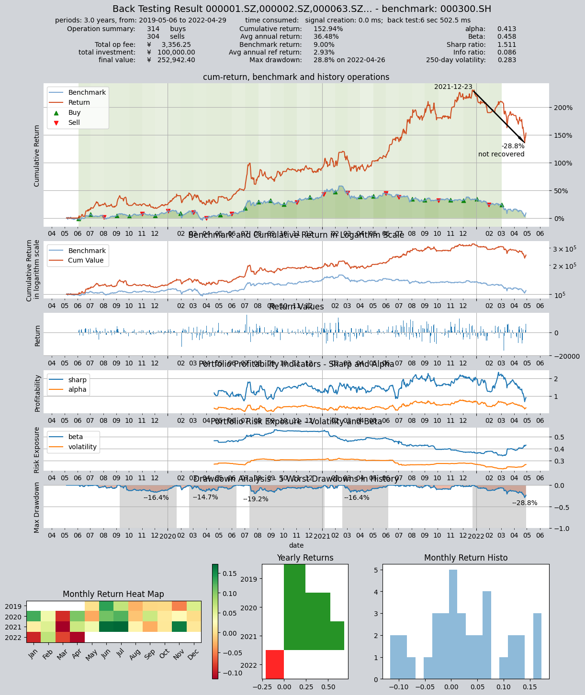
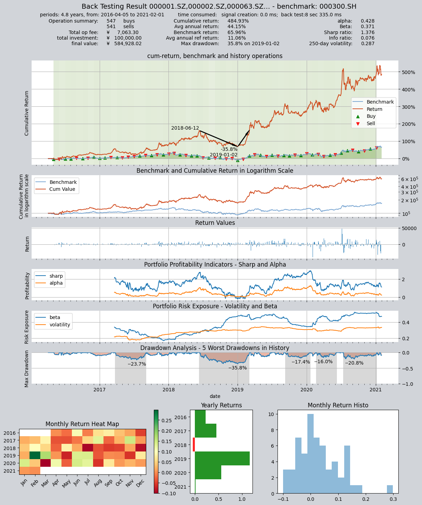

# 自定义策略4: 多因子选股策略

本策略每隔1个月定时触发,根据Fama-French三因子模型对每只股票进行回归，得到其alpha值。
假设Fama-French三因子模型可以完全解释市场，则alpha为负表明市场低估该股，因此应该买入。

策略思路：

计算市场收益率、个股的账面市值比和市值,并对后两个进行了分类,
根据分类得到的组合分别计算其市值加权收益率、SMB和HML. 
对各个股票进行回归(假设无风险收益率等于0)得到alpha值.

选取alpha值小于0并为最小的10只股票进入标的池，平掉不在标的池的股票并等权买入在标的池的股票

回测数据:SHSE.000300的成份股

回测时间为:2019-05-01 到 2022-05-01


## 定义策略

```python
import qteasy as qt
import numpy as np

def market_value_weighted(stock_return, mv, mv_cat, bp_cat, mv_target, bp_target):
    """ 根据mv_target和bp_target计算市值加权收益率

    """
    sel = (mv_cat == mv_target) & (bp_cat == bp_target)
    mv_total = np.nansum(mv[sel])
    mv_weight = mv / mv_total
    return_total = np.nansum(stock_return[sel] * mv_weight[sel])
    return return_total


class MultiFactors(qt.FactorSorter):
    
    def __init__(self, pars: tuple = (0.5, 0.3, 0.7)):
        super().__init__(
                pars=pars,
                par_count=3,
                par_types=['float', 'float', 'float'],  # 参数1:大小市值分类界限，参数2:小/中bp分界线，参数3，中/大bp分界线
                par_range=[(0.01, 0.99), (0.01, 0.49), (0.50, 0.99)],
                name='MultiFactor',
                description='根据Fama-French三因子回归模型估算HS300成分股的alpha值选股',
                strategy_run_timing='close',  # 在周期结束（收盘）时运行
                strategy_run_freq='m',  # 每月执行一次选股（每周或每天都可以）
                strategy_data_types='pb, total_mv, close',  # 执行选股需要用到的股票数据
                data_freq='d',  # 数据频率（包括股票数据和参考数据）
                window_length=20,
                use_latest_data_cycle=True,
                reference_data_types='close-000300.SH',  # 选股需要用到市场收益率，作为参考数据传入
                max_sel_count=10,  # 最多选出10支股票
                sort_ascending=True,  # 选择因子最小的股票
                condition='less',  # 仅选择因子小于某个值的股票
                lbound=0,  # 仅选择因子小于0的股票
                ubound=0,  # 仅选择因子小于0的股票
        )
    
    def realize(self, h, r=None, t=None, pars=None):

        size_gate_percentile, bp_small_percentile, bp_large_percentile = self.pars
        # 读取投资组合的数据PB和total_MV的最新值
        pb = h[:, -1, 0]  # 当前所有股票的PB值
        mv = h[:, -1, 1]  # 当前所有股票的市值
        pre_close = h[:, -2, 2]  # 当前所有股票的前收盘价
        close = h[:, -1, 2]  # 当前所有股票的最新收盘价

        # 读取参考数据(r)
        market_pre_close = r[-2, 0]  # HS300的昨收价
        market_close = r[-1, 0]  # HS300的收盘价

        # 计算账面市值比，为pb的倒数
        bp = pb ** -1
        # 计算市值的50%的分位点,用于后面的分类
        size_gate = np.nanquantile(mv, size_gate_percentile)
        # 计算账面市值比的30%和70%分位点,用于后面的分类
        bm_30_gate = np.nanquantile(bp, bp_small_percentile)
        bm_70_gate = np.nanquantile(bp, bp_large_percentile)
        # 计算每只股票的当日收益率
        stock_return = pre_close / close - 1

        # 根据每只股票的账面市值比和市值，给它们分配bp分类和mv分类
        # 市值小于size_gate的cat为1，否则为2
        mv_cat = np.ones_like(mv)
        mv_cat += (mv > size_gate).astype('float')
        # bp小于30%的cat为1，30%～70%之间为2，大于70%为3
        bp_cat = np.ones_like(bp)
        bp_cat += (bp > bm_30_gate).astype('float')
        bp_cat += (bp > bm_70_gate).astype('float')

        # 获取小市值组合的市值加权组合收益率
        smb_s = (market_value_weighted(stock_return, mv, mv_cat, bp_cat, 1, 1) +
                 market_value_weighted(stock_return, mv, mv_cat, bp_cat, 1, 2) +
                 market_value_weighted(stock_return, mv, mv_cat, bp_cat, 1, 3)) / 3
        # 获取大市值组合的市值加权组合收益率
        smb_b = (market_value_weighted(stock_return, mv, mv_cat, bp_cat, 2, 1) +
                 market_value_weighted(stock_return, mv, mv_cat, bp_cat, 2, 2) +
                 market_value_weighted(stock_return, mv, mv_cat, bp_cat, 2, 3)) / 3
        smb = smb_s - smb_b
        # 获取大账面市值比组合的市值加权组合收益率
        hml_b = (market_value_weighted(stock_return, mv, mv_cat, bp_cat, 1, 3) +
                 market_value_weighted(stock_return, mv, mv_cat, bp_cat, 2, 3)) / 2
        # 获取小账面市值比组合的市值加权组合收益率
        hml_s = (market_value_weighted(stock_return, mv, mv_cat, bp_cat, 1, 1) +
                 market_value_weighted(stock_return, mv, mv_cat, bp_cat, 2, 1)) / 2
        hml = hml_b - hml_s

        # 计算市场收益率
        market_return = market_pre_close / market_close - 1

        coff_pool = []
        # 对每只股票进行回归获取其alpha值
        for rtn in stock_return:
            x = np.array([[market_return, smb, hml, 1.0]])
            y = np.array([[rtn]])
            # OLS估计系数
            coff = np.linalg.lstsq(x, y)[0][3][0]
            coff_pool.append(coff)

        # 以alpha值为股票组合的选股因子执行选股
        factors = np.array(coff_pool)

        return factors

# 策略定义完毕
```

## 运行策略

设置回测参数，运行策略
```python
shares = qt.filter_stock_codes(index='000300.SH', date='20190501')
alpha = MultiFactors()  # 实例化策略
op = qt.Operator(alpha, signal_type='PT')  # 创建Operator交易员对象，使用PT信号类型（仓位目标信号）
op.op_type = 'stepwise'
op.set_blender('1.0*s0', "close")  # 设置仓位调整公式，仓位目标为1.0*s0，即持仓百分比总和等于100%
op.run(mode=1,
       invest_start='20190501',  # 回测起始时间
       invest_end='20220501',  # 回测结束时间
       asset_type='E',  # 股票
       asset_pool=shares,  # 股票池
       trade_batch_size=100,  # 交易最小批量
       sell_batch_size=1,  # 卖出最小批量
       trade_log=True,  # 产生交易记录
      )

print()
```

运行结果如下：

```bash

         ====================================
         |                                  |
         |       BACK TESTING RESULT        |
         |                                  |
         ====================================
    
    qteasy running mode: 1 - History back testing
    time consumption for operate signal creation: 0.0 ms
    time consumption for operation back looping:  6 sec 502.5 ms
    
    investment starts on      2019-05-06 00:00:00
    ends on                   2022-04-29 00:00:00
    Total looped periods:     3.0 years.
    
    -------------operation summary:------------
    Only non-empty shares are displayed, call 
    "loop_result["oper_count"]" for complete operation summary
    
              Sell Cnt Buy Cnt Total Long pct Short pct Empty pct
    000063.SZ    1        1      2     2.7%      0.0%     97.3%  
    000100.SZ    2        2      4     5.9%      0.0%     94.1%  
    000157.SZ    3        3      6     8.6%      0.0%     91.4%  
    000333.SZ    1        1      2     2.7%      0.0%     97.3%  
    000338.SZ    2        2      4     5.5%      0.0%     94.5%  
    000413.SZ    1        1      2     2.9%      0.0%     97.1%  
    000423.SZ    1        1      2     2.7%      0.0%     97.3%  
    000425.SZ    1        1      2     2.7%      0.0%     97.3%  
    000625.SZ    2        2      4     5.6%      0.0%     94.4%  
    000651.SZ    1        1      2     2.7%      0.0%     97.3%  
    ...            ...     ...   ...      ...       ...       ...
    603185.SH    1        1      2     5.8%      0.0%     94.2%  
    603290.SH    1        1      2     5.8%      0.0%     94.2%  
    688005.SH    3        3      6     7.9%      0.0%     92.1%  
    002756.SZ    1        1      2     2.7%      0.0%     97.3%  
    600039.SH    1        1      2     2.8%      0.0%     97.2%  
    600803.SH    1        1      2     2.9%      0.0%     97.1%  
    688187.SH    1        1      2     2.9%      0.0%     97.1%  
    000983.SZ    1        1      2     2.9%      0.0%     97.1%  
    600732.SH    3        3      6     8.2%      0.0%     91.8%  
    601699.SH    1        2      3     8.5%      0.0%     91.5%   
    
    Total operation fee:     ¥    3,356.25
    total investment amount: ¥  100,000.00
    final value:              ¥  252,942.40
    Total return:                   152.94% 
    Avg Yearly return:               36.48%
    Skewness:                         -0.19
    Kurtosis:                          3.08
    Benchmark return:                 9.00% 
    Benchmark Yearly return:          2.93%
    
    ------strategy loop_results indicators------ 
    alpha:                            0.413
    Beta:                             0.458
    Sharp ratio:                      1.511
    Info ratio:                       0.086
    250 day volatility:               0.283
    Max drawdown:                    28.83% 
        peak / valley:        2021-12-23 / 2022-04-26
        recovered on:         Not recovered!
    
    ===========END OF REPORT=============
    

```

    



设置另外的回测区间从2016-04-05到2021-02-01，运行策略，可以看到在不同的区间下该策略都是有效的
```python
shares = qt.filter_stock_codes(index='000300.SH', date='20190501')
alpha = MultiFactors()  # 实例化策略
op = qt.Operator(alpha, signal_type='PT')  # 创建Operator交易员对象，使用PT信号类型（仓位目标信号）
op.op_type = 'stepwise'
op.set_blender('1.0*s0', "close")  # 设置仓位调整公式，仓位目标为1.0*s0，即持仓百分比总和等于100%
op.run(mode=1,
       invest_start='20160405',  # 回测起始时间
       invest_end='20210201',  # 回测结束时间
       asset_type='E',  # 股票
       asset_pool=shares,  # 股票池
       trade_batch_size=100,  # 交易最小批量
       sell_batch_size=1,  # 卖出最小批量
       trade_log=True,  # 产生交易记录
      )

print()
```

运行结果如下：
```bash
         ====================================
         |                                  |
         |       BACK TESTING RESULT        |
         |                                  |
         ====================================
    
    qteasy running mode: 1 - History back testing
    time consumption for operate signal creation: 0.0 ms
    time consumption for operation back looping:  8 sec 335.0 ms
    
    investment starts on      2016-04-05 00:00:00
    ends on                   2021-02-01 00:00:00
    Total looped periods:     4.8 years.
    
    -------------operation summary:------------
    Only non-empty shares are displayed, call 
    "loop_result["oper_count"]" for complete operation summary
    
              Sell Cnt Buy Cnt Total Long pct Short pct Empty pct
    000063.SZ    2        2      4     3.4%      0.0%     96.6%  
    000100.SZ    3        3      6     5.2%      0.0%     94.8%  
    000157.SZ    1        1      2     1.8%      0.0%     98.2%  
    000333.SZ    2        2      4     3.4%      0.0%     96.6%  
    000338.SZ    1        1      2     1.7%      0.0%     98.3%  
    000413.SZ    2        2      4     3.6%      0.0%     96.4%  
    000596.SZ    1        1      2     1.8%      0.0%     98.2%  
    000625.SZ    3        3      6     5.3%      0.0%     94.7%  
    000629.SZ    1        1      2     1.7%      0.0%     98.3%  
    000651.SZ    1        1      2     1.7%      0.0%     98.3%  
    ...            ...     ...   ...      ...       ...       ...
    688005.SH    1        2      3     3.3%      0.0%     96.7%  
    000733.SZ    1        1      2     1.8%      0.0%     98.2%  
    002180.SZ    1        1      2     1.7%      0.0%     98.3%  
    600039.SH    1        1      2     1.7%      0.0%     98.3%  
    600803.SH    1        1      2     1.7%      0.0%     98.3%  
    601615.SH    1        1      2     1.8%      0.0%     98.2%  
    000983.SZ    2        2      4     3.3%      0.0%     96.7%  
    600732.SH    3        4      7     6.7%      0.0%     93.3%  
    600754.SH    1        1      2     1.8%      0.0%     98.2%  
    601699.SH    1        1      2     1.7%      0.0%     98.3%   
    
    Total operation fee:     ¥    7,063.30
    total investment amount: ¥  100,000.00
    final value:              ¥  584,928.02
    Total return:                   484.93% 
    Avg Yearly return:               44.15%
    Skewness:                         -0.14
    Kurtosis:                          2.77
    Benchmark return:                65.96% 
    Benchmark Yearly return:         11.06%
    
    ------strategy loop_results indicators------ 
    alpha:                            0.428
    Beta:                             0.371
    Sharp ratio:                      1.376
    Info ratio:                       0.076
    250 day volatility:               0.287
    Max drawdown:                    35.84% 
        peak / valley:        2018-06-12 / 2019-01-02
        recovered on:         2019-03-05
    
    ===========END OF REPORT=============
```

    

    

