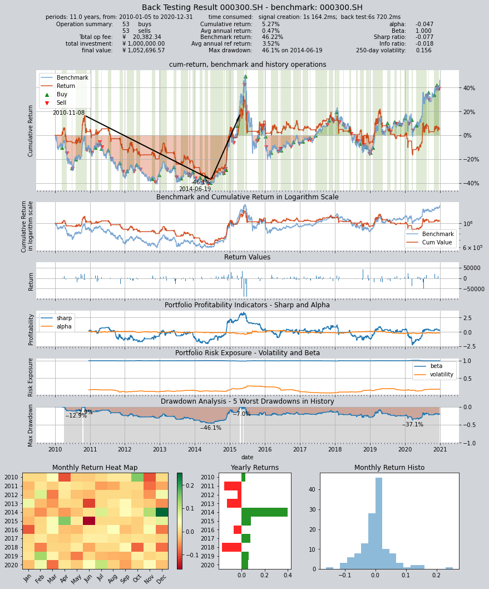
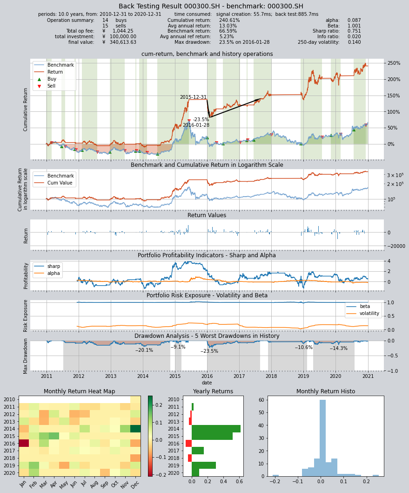

# 教程3—创建交易策略并评价回测结果

`qteasy`中的所有交易策略都是通过`qteast.Operator`（交易员）对象来实现回测和运行的，`Operator`对象是一个策略容器，一个交易员可以同时
管理多个不同的交易策略，哪怕这些交易策略有不同的运行时机和运行频率，或者不同的用途，例如一个策略用于选股、另一个策略用于大盘择时，再一个策
略用于风险控制，用户可以非常灵活地添加或修改`Operator`对象中的策略。

将策略交给`Operator`后，只要设置好交易的资产类别，资产池的大小，设定好每个策略的运行时机和频率后，`Operator`对象就会在合适的时间启动相应的
交易策略，生成策略信号，并将所有的策略信号混合(`blend`)后解析成为交易信号。

关于`Operator`对象的更多介绍，请参见`qteasy`文档

`queasy`提供了两种方式创建交易策略：

- *使用内置交易策略组合*：
  - `qteasy`提供多种内置交易策略可供用户使用，不需要手工创建。通过引用内置策略的名称（关于所有内置策略的介绍，请参
  见详细文档）用户可以快速建立策略，还可以通过多个简单的策略混合成较为复杂的复合策略。
- *通过策略类自行创建策略*： 
  - 当用户的策略非常复杂时，可以通过`qteasy.Strategy`类来自定义一个策略。


创建交易策略，并且使用历史数据回溯测试交易策略的交易结果，并对交易结果进行评价是qteasy的核心功能之一。
qteasy通过一个交易员对象（Operator）汇总一系列的交易策略，并且通过qt.run()函数在一段设定好的历史时间段内模拟交易策略的运行，生成交易信号，使用历史价格进行模拟交易，生成交易结果，计算评价指标，并以可视化形式输出为图表。

本章节以一个最常见的基金择时投资策略为例子，演示了以下内容：
- 创建一个简单的dma择时投资策略，创建一个交易员对象使用这个策略，演示如何修改、添加策略
- 通过`qt.configure()`设置相关的环境变量，使用过去10年的沪深300指数历史数据，回测策略表现
- 通过对过去10年左右的沪深300指数历史数据，对策略进行参数寻优，最终演示寻优后的结果

首先我们导入qteasy模块
为了在线打印图表，使用`matplotlib inline`设置图表打印模式为在线打印


## 创建Strategy对象和Operator对象
qteasy中的每一个交易策略都被定义为交易策略（Strategy）对象。每个交易对象包含了一系列的交易规则，这些规则包括三个方面：
1. **策略运行规则**，包括策略运行的频率，所使用的历史数据类型，历史数据窗口长度，定义了策略如何运行以及如何使用历史数据
2. **信号生成规则**，交易信号的生成规则，即如何根据相关历史数据生成何种交易信号，这是交易策略的核心
3. **交易信号类型**，交易信号的不同类型决定了模拟交易模块如何处理交易信号

在qteasy中，交易策略是由交易员对象（Operator）执行的，同一时间只能有一个Operator对象在运行，但是同一个交易员可以同时执行一个或多个交易策略，这些交易策略可以针对同一个投资组合进行交易，用户可以定义特定的“混合”方法，把多个简单交易策略混合成为一个复杂交易策略运行。

### 创建Strategy对象

创建Strategy对象的最简单方法是使用qt.built_in模块, 也可以在创建Operator对象的时候同时创建。

```python
import qteasy as qt
# 通过qt内置策略模块创建一个DMA则时策略
stg = qt.built_in.DMA()
# 通过stg.info()可以查看策略的主要信息：
stg.info()
```
```commandline
Strategy_type:      RuleIterator
Strategy name:      DMA
Description:        Quick DMA strategy, determine long/short position according to differences of moving average prices with simple timing strategy
Strategy Parameter: (12, 26, 9)

Strategy Properties     Property Value
-------------------------------------------------
Param. count            3
Param. types            ['int', 'int', 'int']
Param. range            [(10, 250), (10, 250), (5, 250)]
Run parameters          d @ close
Data types              ['close']
Data parameters         270 d
```


从上面的输出可以看到这个交易策略的基本信息。除了名称、描述以外，比较重要的信息包括：

- **策略参数 Strategy Parameter**。策略参数是策略运行过程中所需的外部参数，根据策略规则的不同，策略使用的参数也不同，这些参数对策略的运行过程产生影响，不同的参数会影响策略的输出。例如，在双均线则时策略中，长均线的计算周期和短均线的计算周期就是两个策略参数。
- **参数类型/范围 Parameter Types / Range**: 不同的策略参数会极大地影响一个策略的最终结果，设置好参数的取值范围和类型之后，qteasy可以通过不同方法在参数空间内搜索最佳参数，使策略的性能达到最佳。
- **策略数据频率和运行频率 Data Frequcney / Sample Frequency**。策略运行的频率以及所需数据的频率，例如每周执行一次，每月执行一次或每分钟执行一次等等，一般来说数据频率与执行频率相关
- **数据类型 Data Types**：运行策略所需要读取的历史数据类型。对DMA策略来说，仅需要收盘价即可。

也要查看所有的内置策略，可以使用qt.built_ins()函数，如果不给出函数的参数，则会显示所有内置策略的列表，如果给出参数，则会显示指定内置策略的详细信息。
例如：

```python
qt.built_ins('dma')
```
得到：
```commandline
 DMA择时策略

    策略参数：
        s, int, 短均线周期
        l, int, 长均线周期
        d, int, DMA周期
    信号类型：
        PS型：百分比买卖交易信号
    信号规则：
        在下面情况下产生买入信号：
        1， DMA在AMA上方时，多头区间，即DMA线自下而上穿越AMA线后，输出为1
        2， DMA在AMA下方时，空头区间，即DMA线自上而下穿越AMA线后，输出为0
        3， DMA与股价发生背离时的交叉信号，可信度较高

    策略属性缺省值：
    默认参数：(12, 26, 9)
    数据类型：close 收盘价，单数据输入
    采样频率：天
    窗口长度：270
    参数范围：[(10, 250), (10, 250), (8, 250)]
    策略不支持参考数据，不支持交易数据
```
更多关于内置策略的函数包括：

### `qt.built_ins(stg_id=None)`
如果stg_id=None，显示所有内置策略的列表，否则显示指定内置策略的详细信息
### `qt.built_in_list(stg_id=None)`
如果stg_id=None，返回所有内置策略的列表，否则返回指定内置策略的详细信息
### `qt.built_in_strategies(stg_id=None)`
如果stg_id=None，返回所有内置策略的列表，否则返回指定内置策略的详细信息
### `qt.get_built_in_strategy(stg_id)`
根据给出的内置策略ID，返回内置策略对象

### 创建Operator对象

使用`qt.Operator()`可以创建`Operator`对象。
创建一个Operator对象后，所有的交易策略都由交易员对象来负责运行。创建交易员对象时可以指定交易信号的处理方式以及交易运行的方式：

###  `qt.Operator(strategies=None, signal_type=None, op_type=None)`

- `strategies`: 交易员对象中的交易策略，可以是一个或多个交易策略，也可以是一个交易策略的列表。如果不指定交易策略，则创建一个空的交易员对象，交易策略可以事后添加或删除。一旦添加了交易策略，交易员对象会为每一个交易策略赋予一个唯一的ID，这个ID可以用来引用这个交易策略。同时，交易员对象会根据策略的运行频率和运行时机，自动为每一个交易策略分配一个运行时机，只有在运行时机到来时，交易员对象才会执行这个交易策略，生成交易信号。
- `signal_type`: 交易信号的类型，可以是`'pt'`，`'ps'`或者`'vs'`，默认`'pt'`，分别代表目标持仓比例信号，百分比交易信号和数量交易信号。不同的交易信号类型决定了交易员对象如何处理交易信号，以及交易员对象如何将多个交易策略的交易信号混合成为一个交易信号。
- `op_type`: 交易员对象的运行模式，可以是`'batch'`或者`'realtime'`，默认`'batch'`，分别代表批量运行模式和实时运行模式。在批量运行模式下，交易员对象会在回测或者优化模式下，预先生成交易信号，再批量进行模拟交易，运行速度较快。在实时运行模式下，交易员对象会生成交易信号立即模拟交易，产生模拟交易结果后，再进行下一次交易信号生成，适用于实盘交易运行模式，或特殊情况下的回测模式。

对于qteasy来说，交易策略的交易信号和股票/基金的交易订单是两个不同的概念。

所有的交易策略都是基于历史数据生成的交易信号，而交易员对象则根据交易信号生成交易订单，然后模拟交易员的交易行为，最终生成交易结果。


#### 策略的三种信号类型

在qteasy中，交易信号是一个浮点数，同一个交易信号可以代表不同的含义，从而被交易员对象解读为不同的交易订单。交易信号的含义由交易员对象的信号类型决定，交易员对象的信号类型可以是`'pt'`，`'ps'`或者`'vs'`，分别代表目标持仓比例信号，百分比交易信号和数量交易信号。

交易信号的类型包括三类：
- **PT**: 此时交易信号代表目标持仓比例，也就是说持有的股票的价值占总资产的比例，例如当前总资产为100万元时，0.2代表控制当前某股票或基金的持有数量，使其市值为100万元的20%也就是20万元。在这种情况下，买入或卖出股票的数量取决于当前持有的股票的数量，如果当前持有的股票数量为0，则买入20万元的股票，如果当前持有的股票价值为30万元，则需要卖出10万元。
- **PS**: 此时交易信号直接代表买卖比例，在这种情况下，买入或卖出股票的数量与当前持有的股票的数量无关，只与总资产有关。如果总资产为100万元时，0.2代表买入20万元的股票。
- **VS**: 此时交易信号直接代表买卖数量，在这种情况下，买入或卖出股票的数量与总资产或持股数量无关。2000代表买入2000股的股票。

不仅如此，如果根据交易员操作的账户类型不同（如股票账户或期货账户），生成的交易订单也会不同。具体的说明如下表：
<table>
    <thead>
        <tr>
            <th>账户类型</th>
            <th>信号类型</th>
            <th>交易信号</th>
            <th>信号含义</th>
            <th>信号举例</th>
            <th>交易订单举例</th>
        </tr>
    </thead>
    <tbody>
        <tr>
            <td rowspan=9>股票账户</td>
            <td rowspan=3>PT</td>
            <td>sig > 0</td>
            <td>持有该资产，并使持有资产的市值为总资产的sig倍</td>
            <td>0.5</td>
            <td>根据当前持有的资产比例确定交易订单，如果已经满仓持有，则卖掉50%仓位，如果持仓为0，则买入至50%仓位</td>
        </tr>
        <tr>
            <td>sig = 0</td>
            <td>清空全部持有的资产，持有资产为0</td>
            <td>0</td>
            <td>根据当前持有的资产比例确定交易订单，如果持仓则卖掉全部持仓，如果没有持仓则不交易</td>
        </tr>
        <tr>
            <td>sig < 0</td>
            <td>无意义</td>
            <td>N/A</td>
            <td>N/A</td>
        </tr>
        <tr>
            <td rowspan=3>PS</td> 
            <td>sig > 0</td>
            <td>买入该资产，买入的金额占总资产的比例为sig</td>
            <td>0.5</td>
            <td>总资产为100,000，则此时花费50,000元金额买入资产(含手续费)</td>
        </tr>
        <tr>
            <td>sig = 0</td>
            <td>不进行任何操作</td>
            <td>0</td>
            <td>不进行任何操作</td>
        </tr>
            <td>sig < 0</td>
            <td>卖出该资产，卖出的部分占当前持有数量的比例为sig</td>
            <td>-0.5</td>
            <td>假设当前持有1000股，则此时应卖出500股</td>
        <tr>
            <td rowspan=3>VS</td> 
            <td>sig > 0</td>
            <td>买入该资产，买入的数量为sig</td>
            <td>500</td>
            <td>买入500股</td>
        </tr>
        <tr>
            <td>sig = 0</td>
            <td>不进行任何操作</td>
            <td>0</td>
            <td>不进行任何操作</td>
        </tr>
            <td>sig < 0</td>
            <td>卖出该资产，卖出的数量为abs(sig)</td>
            <td>-500</td>
            <td>卖出500股</td>
        <tr>
            <td rowspan=11>期货账户 (未实现)</td>
            <td rowspan=3>PT</td>
            <td>sig > 0</td>
            <td>平掉所有空仓，开多仓，并使持有合约价值为总资产的sig倍</td>
            <td>1.5</td>
            <td>假设总资产为100,000，开多仓持有总价150,000的合约 <br>*当保证金比例<1时，持仓比例可以大于100%</td>
        </tr>
        <tr>
            <td>sig = 0</td>
            <td>平掉全部持有的仓位，持有头寸为0</td>
            <td>0</td>
            <td>平掉所有持有的多仓和空仓</td>
        </tr>
        <tr>
            <td>sig < 0</td>
            <td>平掉所有多仓，开空仓，并使持有合约价值为总资产的sig倍</td>
            <td>-1.5</td>
            <td>总资产为100,000，则开空仓持有总价150,000的合约<BR>* 如果保证金比例<1时，持空仓比例可以大于100%</td>
        </tr>
        <tr>
            <td rowspan=5>PS</td> 
            <td rowspan=2>sig > 0</td>
            <td>如果持有空仓：平部分空仓，平空仓的数量占总持有的比例为sig</td>
            <td>0.5</td>
            <td>如果总持仓为1,000手，则此时平仓500手<br>* 此时sig必须小于等于1</td>
        </tr>
        <tr>
            <td>如果持有多仓：开多仓，开仓的合约价值占总资产的比例为sig</td>
            <td>1.5</td>
            <td>如果总资产为100,000，则开多仓持有总价150,000元的合约 <br>* 如果保证金比例<1时，sig可以大于1</td>
        </tr>
        <tr>
            <td>sig = 0</td>
            <td>不进行任何操作</td>
            <td>0</td>
            <td>不进行任何操作</td>
        </tr>
        <tr>
            <td rowspan=2>sig < 0</td>
            <td>如果持有多仓：平部分多仓，平仓的数量占总持有的比例为sig</td>
            <td>0.5</td>
            <td>如果总持仓为1,000手，则此时平仓500手<br>* 此时sig必须小于等于1</td>
        </tr>
        <tr>
            <td>如果持有空仓：开空仓，开仓的合约价值占总资产的比例为sig</td>
            <td>1.5</td>
            <td>如果总资产为100,000，则开空仓持有总价150,000元的合约 <br>* 如果保证金比例<1时，sig可以大于1</td>
        </tr>
        <tr>
            <td rowspan=3>VS</td> 
            <td>sig > 0</td>
            <td>平空仓或开多仓，开平仓的数量为sig。如果持有空头数量超过sig则忽略剩余部分</td>
            <td>1500</td>
            <td>如果持有1500手以上空头仓位，则平仓1500手，如果当前没有持仓，则开多仓持有1500手合约</td>
        </tr>
        <tr>
            <td>sig = 0</td>
            <td>不进行任何操作</td>
            <td>0</td>
            <td>不进行任何操作</td>
        </tr>
            <td>sig < 0</td>
            <td>平多仓或开空仓，开平仓的数量为sig。如果持有多头数量超过sig则忽略剩余部分</td>
            <td>-500</td>
            <td>如果持有1500手以上多头仓位，则平仓1500手，如果当前没有持仓，则开空仓持有1500手合约</td>
    </tbody>
</table>


#### 交易信号的混合

尽管同一个Operator对象同时只能生成一种类型的信号，但由于Operator对象能容纳无限多个不同的交易策略，因而Operator对象
也能产生无限多组同类型的交易策略。为了节省交易回测时的计算开销，避免冲突的交易信号或重复的交易信号占用计算资源，同时也
为了增加交易信号的灵活度，应该将所有交易信号首先混合成一组，再送入回测程序进行回测。

不过，在一个Operator对象中，不同策略生成的交易信号可能运行的交易价格是不同的，例如，某些策略生成开盘价交易信号，而另一
些策略生成的是收盘价交易策略，那么不同的交易价格信号当然不应该混合。但除此之外，只要是交易价格相同的信号，都应该全部混合。

交易信号的混合即交易信号的各种运算或函数，从简单的逻辑运算、加减运算一直到复杂的自定义函数，只要能够应用于一个ndarray的
函数，理论上都可以用于混合交易信号，只要最终输出的交易信号有意义即可。

交易信号的混合基于一系列事先定义的运算和函数，这些函数或运算都被称为"原子函数"或"算子"，用户利用这些"算子"来操作
Operator对象生成的交易信号，并将多个交易信号组变换成一个唯一的交易信号组，同时保持其形状不变，数字有意义。

交易信号的混合是由一个混合表达式`blender`来确定的，例如`s0 and (s1 + s2) * avg(s3, s4)`

`blender`表达式中支持的函数如下：

| 元素       |  示例   | 说明                                                         |
| :--------- | :-----: | :----------------------------------------------------------- |
| 策略序号   |  `s1`   | 以s开头，数字结尾的字符串，数字为`Operator`中的策略的序号，代表这个策略生成的交易信号 |
| 数字       | `-1.35` | 任何合法的数字，参与表达式运算的数字                         |
| 运算符     |   `+`   | 包括`'+-*/^'`等四则运算符                                    |
| 逻辑运算符 |  `and`  | 支持`'&|~'`以及`'and/or/not'`形式的逻辑运算符                |
| 函数       | `sum()` | 支持的函数参见后表                                           |
| 括号       |  `()`   | 组合运算                                                     |

关于更多的混合表达式的例子，请参见`qteasy` [Tutorial 04 - 使用内置交易策略](https://github.com/shepherdpp/qteasy/blob/master/tutorials/Tutorial%2004%20-%20使用内置交易策略.md)

```python
op = qt.Operator()
```

    OPERATOR INFO:
    =========================
    Information of the Module
    =========================
    Total 0 operation strategies, requiring 0 types of historical data:
    
    0 types of back test price types:
    []


交易员对象是一个策略容器，在一个Operator对象中可以添加任意多个交易策略，同时，在Operator对象中，可以管理交易策略的混合方式(blender)，交易信号的处理方式以及交易运行的方式。

常用的Operator属性及方法如下：

### 获取Operator对象的基本信息

### `op.info()`
打印Operator对象的重要信息

### `op.strategies`
获取Operator对象中所有交易策略的清单

### `op.strategy_ids`
获取Operator对象中所有交易策略的ID

### `op.strategy_count`
获取Operator对象中交易策略的数量

### `op.signal_type`
Operator对象的信号类型，代表交易信号的含义及处理方式：
- **'pt': 目标持仓比例信号**，在这个模式下，交易员关注一个投资组合中各个成份股票的持仓比例，通过适时的买入和买出，维持各个成份股的持仓比例在一个目标值上；
- **'ps': 百分比交易信号**，在这个模式下，交易员关注定时产生的比例交易信号，根据交易信号按比例买入或买出股票
- **'vs': 数量交易信号**，在这个模式下，交易员关注定时产生的交易信号，按照交易信号买入或买出一定数量的股票

### `op.op_type`
Operator对象的运行模式：
- 'batch': 批量运行模式，在回测模式或优化模式下，预先生成交易清单，再批量进行模拟交易，运行速度较快
- 'realtime': 实时运行模式，生成交易信号立即模拟交易，产生模拟交易结果后，再进行下一次交易信号生成，适用于实时运行模式，或特殊情况下的回测模式

### 获取交易策略

### `op.get_stg(stg_id)`
通过策略ID获取策略对象，下面的方法效果相同，且可以通过数字序号来获取策略
```
stg = op.get_stg(stg_id)
stg = op[stg_id] 
stg = op[stg_idx]
```
### 添加或修改交易策略

### `op.add_strategy(stg, **kwargs)`
添加一个策略到Operator，添加策略的同时可以同时设置策略参数

### `op.add_strategies(strategies)`
批量添加一系列策略到Operator，添加的同时不能同时设置策略参数

### `op.remove_strategy(id_or_pos=None)`
从Operator中删除一个策略

### `op.clear_strategies()`
清除Operator中的所有交易策略

### 设置策略参数或Operator参数

### `op.set_parameter(stg_id, pars=None, opt_tag=None, par_range=None, par_types=None, data_freq=None, strategy_run_freq=None, window_length=None, data_types=None, strategy_run_timing=None, **kwargs)`
指定一个交易策略的ID，设置这个交易策略的策略参数或其他属性

### `op.set_blender(price_type=None, blender=None)` 
设置交易策略的混合方式。当Operator中有多个交易策略时，每个交易策略分别运行生成多组交易信号，再按照用户定义的规则混合后输出一组交易信号，用于交易

我们可以用下面的代码将刚创建的DMA策略加入到Operator中去，并设置必要的策略参数

所有的参数设置都可以使用`operator.set_parameter`方法，可以同时传入多个参数
通过设置策略的`opt_tag`可以控制策略是否参与优化，而`par_range`参数定义了策略优化时需要用到的参数空间
在此时我们并不知道对于过去15年的沪深300指数来说，最优的DMA择时参数是什么，因此可以输入几个随机的参数，进行一次回测，看看结果如何


```python
op.clear_strategies()
op.add_strategy(stg, pars=(26, 35, 189), opt_tag=1)
print(f'Operator strategies: {op.strategies}')
print(f'Strategy IDs are: {op.strategy_ids}')
op.info(verbose=True)
```

    Operator strategies: [RULE-ITER(DMA)]
    Strategy IDs are: ['custom']
    OPERATOR INFO:
    =========================
    Information of the Module
    =========================
    Total 1 operation strategies, requiring 1 types of historical data:
    close
    1 types of back test price types:
    ['close']
    for backtest histoty price type - close: 
    [RULE-ITER(DMA)]:
    no blender
    Parameters of GeneralStg Strategies:
    Strategy_type:      RuleIterator
    Strategy name:      DMA
    Description:        Quick DMA strategy, determine long/short position according to differences of moving average prices with simple timing strategy
    Strategy Parameter: (26, 35, 189)
    
    Strategy Properties     Property Value
    ---------------------------------------
    Parameter count         3
    Parameter types         ['int', 'int', 'int']
    Parameter range         [(10, 250), (10, 250), (10, 250)]
    Data frequency          d
    Sample frequency        d
    Window length           270
    Data types              ['close']
    
    =========================


### 配置qteasy的回测参数

Operator对象创建好并添加策略后就可以开始进行回测了

qteasy提供了丰富的环境参数以控制回测的具体过程
所有的环境参数变量值都可以通过`qt.Configuration()`查看，并通过`qt.Configure()`来设置。

### `qt.configuration()`
查看qteasy运行环境变量

### `qt.configure()`
设置qteasy运行环境变量

与回测相关的主要环境变量参数包括：

- 回测交易的目标股票/指数
- 回测交易的起止时间段
- 回测交易的初始投资金额
- 回测交易的交易费用和交易规则
- 交易结果评价的基准指数

以上所有回测交易参数都可以通过`qt.configure()`设置:


```python
qt.configure(
    mode=1,  # 设置运行模式为：1-回测模式
    benchmark_asset = '000300.SH',  # 设置交易评价基准
    benchmark_asset_type = 'IDX',  # 设置交易评价基准的资产类型
    asset_pool = '000300.SH',  # 设置交易资产组合
    asset_type = 'IDX',  # 交易资产组合的资产类型
    trade_batch_size = 0,  # 设置允许最小交易批量
    invest_start = '20100105',  # 设置交易开始日期
    invest_end = '20201231',  # 设置交易终止日期
    invest_cash_amounts = [1000000],  # 设置初始交易投资金额为十万元
    visual=True  # 输出可视化交易结果图表
)
```

### 启动qteasy并开始运行Operator

### `qt.run(operator, **config)`
开始运行Operator，根据运行的mode，qteasy会进入到不同的运行模式，输出不同的结果：

- **mode 0 实时模式**：读取最近的（实时）数据，生成当前最新的交易信号。再此模式下，可以设置qteasy定期执行，定期读取最新数据，定期生成实时交易信号
- **mode 1 回测模式**：读取过去一段时间内的历史数据，使用该数据生成交易信号并模拟交易，输出模拟交易的结果
- **mode 2 优化模式**：读取过去一段时间内的历史数据，通过反复运行同一套交易策略但使用不同的参数组合，搜索在这段时间内表现最佳的策略参数

只要运行`qteasy.run(operator, **config)`就可以开始运行Operator了，其中`**config`是测试环境参数，在qt.run()中以参数形式传入的环境变量仅仅在本次运行中有效，但是在qt.configure()中设置的环境变量将一直有效，直到下次改变为止


回测最终资产为19万元，年化收益率只有4.83%，夏普率只有0.0783，收益率低于同期沪深300指数


```python
qt.run(op)
```

运行qteasy后，系统会自动读取历史数据，进行回测，完成结果评价并打印回测报告。

回测报告会包含以下信息：

- 回测计算耗时
- 回测区间开始日期及结束日期、持续时间等信息
- 交易统计信息：如买入次数、卖出次数，满仓比例，空仓比例、总交易费用等
- 收益信息：初始投资额，最终资产额，总收益率，年化收益率，基准总收益率，基准年化收益率，收益率的峰度和偏度
- 投资组合评价指标：Alpha，Beta、夏普率、信息比率、波动率以及最大回撤

```
         ====================================
         |                                  |
         |       BACK TESTING RESULT        |
         |                                  |
         ====================================
    
    qteasy running mode: 1 - History back testing
    time consumption for operate signal creation: 1s 164.2ms
    time consumption for operation back looping:  6s 720.2ms
    
    investment starts on      2010-01-05 00:00:00
    ends on                   2020-12-31 00:00:00
    Total looped periods:     11.0 years.
    
    -------------operation summary:------------
    
              Sell Cnt Buy Cnt Total Long pct Short pct Empty pct
    000300.SH    53       53    106   54.0%      0.0%     46.0%   
    
    Total operation fee:     ¥   20,382.34
    total investment amount: ¥1,000,000.00
    final value:              ¥1,052,696.57
    Total return:                     5.27% 
    Avg Yearly return:                0.47%
    Skewness:                         -0.76
    Kurtosis:                         11.44
    Benchmark return:                46.22% 
    Benchmark Yearly return:          3.52%
    
    ------strategy loop_results indicators------ 
    alpha:                           -0.047
    Beta:                             1.000
    Sharp ratio:                     -0.077
    Info ratio:                      -0.018
    250 day volatility:               0.156
    Max drawdown:                    46.12% 
        peak / valley:        2010-11-08 / 2014-06-19
        recovered on:         2015-04-17
     
    ===========END OF REPORT=============
```
除了回测报告以外，一张可视化图表也会被打印出来，显示整个回测过程的详细信息。

在这张信息图中，会显示以下信息：

- 整个回测历史的收益率曲线图（同时显示持仓区间、卖卖点、基准收益率曲线和最大回撤区间）
- 对数比例收益率曲线和基准收益率对比图
- 每日收益变动图
- 滚动夏普率和alpha率变动图（投资组合盈利能力评价）
- 滚动波动率（Volatility）和Beta率变动图（投资组合风险评价）
- 历史回撤分析图（潜水图）
- 月度、年度收益率热力图和条形图
- 月度收益率统计频率直方图



    
在`qteasy`模拟的交易过程中，可以设置丰富的参数，例如：

- 投入资金的数量、日期、或者设置分批多次投入资金；
- 买入和卖出交易的费用、包括佣金费率、最低费用、固定费用、以及滑点。各种费率都可以针对买入和卖出分别设定
- 买入和卖出交易的交割时间，也就是T+N日交割制度
- 买入和卖出交易的最小批量，例如是否允许分数份额交易、还是必须整数份额、甚至整百份交易

最终打印的回测结果是考虑上述所有交易参数之后的最终结果，因此可以看到总交易成本。详细的交易参数设置请参见详细文档。

另外，`qteasy`还给给出了关于策略表现的几个指标：
如alpha和beta分别是0.067和1.002，而夏普率为0.041。最大回撤发生在2009年8月3日到2014年7月10日，回撤了35.0%，且到了2014年12月16日才翻盘。

在上面的回测结果中我们给出了参数`visual=False`，如果令`visual=True`，就能得到可视化的回测结果，以图表的形式给出，并提供可视化信息：

- 投资策略的历史资金曲线
- 参考数据（沪深300指数）的历史曲线
- 买点和卖点（在参考数据上以红色、绿色箭头显示）
- 持仓区间（绿色表示持仓）
- 投资策略的评价指标（alpha、sharp等）
- 历史回撤分析（显示五次最大的回撤）
- 历史收益率热力图、山积图等图表


`qteasy`提供了丰富的策略回测选项，例如：

- 回测开始结束日期
- 回测结果评价指标
- 回测时是否允许持有负数仓位（用于模拟期货交易卖空行为，也可以使用专门的期货交易模拟算法）

更多的选项请参见详细文档

### 单择时策略的优化
显然，没有经过优化的参数无法得到理想的回测结果，因此我们需要进行一次优化

通过设置context对象的各个参数，我们可以设置优化方式并控制优化过程：
以下参数的含义分别如下：

- 优化方法设置为1，使用蒙特卡洛优化，对于较大的参数空间有较好的寻优能力
- 输出结果数量设置为30
- 优化过程迭代次数为1000次
- parallel参数设置为True会使用多核处理器的所有核心进行并行计算节省时间

最后开始优化，使用`perfs_dma`和`pars_dma`两个变量来存储优化结果
优化过程中会显示进度条，结束后会显示优化结果


```python
pars_dma = qt.run(op, 
                  mode=2,
                  opti_method=1,
                  opti_sample_count=1000,
                  opti_start='20101231',
                  opti_end='20201231',
                  opti_cash_dates='20101231',
                  test_start='20101231',
                  test_end='20201231',
                  test_cash_dates='20101231',
                  parallel=True)
print(f'optimization completed, 50 parameters found, they are\n'
      f'{pars_dma}')
```


    [########################################]1000/1000-100.0%  best performance: 340613.629
    Optimization completed, total time consumption: 38"247
    [########################################]30/30-100.0%  best performance: 340613.629
    ==================================== 
    |                                  |
    |       OPTIMIZATION RESULT        |
    |                                  |
    ====================================
    
    qteasy running mode: 2 - Strategy Parameter Optimization
    
    investment starts on 2010-12-31 00:00:00
    ends on 2020-12-31 00:00:00
    Total looped periods: 10.0 years.
    total investment amount: ¥   100,000.00
    Reference index type is 000300.SH at IDX
    Total Benchmark rtn: 66.59% 
    Average Yearly Benchmark rtn rate: 5.23%
    statistical analysis of optimal strategy messages indicators: 
    total return:        161.24% ± 29.73%
    annual return:       10.01% ± 1.18%
    alpha:               0.048 ± 0.014
    Beta:                1.001 ± 0.001
    Sharp ratio:         0.625 ± 0.089
    Info ratio:          0.013 ± 0.004
    250 day volatility:  0.151 ± 0.006
    other messages indicators are listed in below table
    
        Strategy items  Sell-outs Buy-ins ttl-fee      FV      ROI   Benchmark rtn  MDD 
    0    (147, 157, 57)    25.0     25.0  1,213.16 231,710.13 131.7%     66.6%     38.1%
    1    (88, 108, 127)    16.0     15.0  1,009.93 233,554.10 133.6%     66.6%     44.3%
    2    (105, 160, 29)    21.0     20.0  1,344.78 232,247.09 132.2%     66.6%     26.4%
    3    (149, 194, 24)    19.0     19.0  1,062.61 233,932.11 133.9%     66.6%     33.4%
    4    (105, 185, 25)    18.0     17.0  1,094.07 236,171.54 136.2%     66.6%     40.6%
    5    (86, 147, 107)    11.0     10.0    668.08 234,827.39 134.8%     66.6%     39.7%
    6    (88, 157, 101)    11.0     10.0    715.01 236,851.09 136.9%     66.6%     31.6%
    7    (144, 181, 57)    19.0     19.0  1,093.20 240,445.16 140.4%     66.6%     33.8%
    8     (94, 165, 78)    12.0     11.0    724.66 240,825.90 140.8%     66.6%     38.1%
    9    (68, 113, 142)    13.0     12.0    819.42 244,805.70 144.8%     66.6%     42.5%
    10     (80, 64, 57)    30.0     30.0  1,767.04 245,084.54 145.1%     66.6%     28.8%
    11   (101, 124, 65)    23.0     22.0  1,726.89 245,504.45 145.5%     66.6%     30.7%
    12   (150, 189, 33)    20.0     20.0  1,142.62 246,185.41 146.2%     66.6%     34.3%
    13   (119, 200, 30)    12.0     11.0    705.66 248,111.42 148.1%     66.6%     24.1%
    14   (52, 111, 136)    14.0     13.0    810.29 254,764.49 154.8%     66.6%     40.5%
    15    (55, 151, 87)    14.0     13.0    896.37 248,370.33 148.4%     66.6%     38.2%
    16    (98, 129, 45)    22.0     21.0  1,480.50 252,764.13 152.8%     66.6%     37.1%
    17    (101, 59, 50)    27.0     26.0  1,505.08 255,487.88 155.5%     66.6%     28.8%
    18   (179, 240, 25)    19.0     19.0  1,149.62 259,380.09 159.4%     66.6%     33.8%
    19   (82, 127, 144)    12.0     11.0    810.46 268,321.59 168.3%     66.6%     37.4%
    20   (44, 135, 117)    13.0     12.0    741.60 268,837.16 168.8%     66.6%     42.6%
    21   (103, 127, 57)    22.0     21.0  1,628.33 269,776.04 169.8%     66.6%     30.3%
    22   (128, 152, 92)    15.0     15.0    883.81 272,170.16 172.2%     66.6%     32.6%
    23    (91, 198, 13)    17.0     16.0  1,209.55 277,214.25 177.2%     66.6%     43.3%
    24  (102, 110, 129)    26.0     25.0  2,056.58 311,876.36 211.9%     66.6%     33.4%
    25   (129, 204, 16)    14.0     14.0    840.49 279,142.60 179.1%     66.6%     32.6%
    26    (90, 185, 45)    11.0     10.0    735.84 279,320.37 179.3%     66.6%     40.6%
    27  (104, 111, 107)    30.0     29.0  2,207.23 317,371.14 217.4%     66.6%     41.0%
    28   (101, 150, 24)    23.0     22.0  2,012.97 331,442.65 231.4%     66.6%     26.4%
    29   (104, 142, 87)    15.0     14.0  1,044.25 340,613.63 240.6%     66.6%     23.5%
    
    ===========END OF REPORT=============
    
    [########################################]30/30-100.0%  best performance: 340613.629
    ==================================== 
    |                                  |
    |       OPTIMIZATION RESULT        |
    |                                  |
    ====================================
    
    qteasy running mode: 2 - Strategy Parameter Optimization
    
    investment starts on 2010-12-31 00:00:00
    ends on 2020-12-31 00:00:00
    Total looped periods: 10.0 years.
    total investment amount: ¥   100,000.00
    Reference index type is 000300.SH at IDX
    Total Benchmark rtn: 66.59% 
    Average Yearly Benchmark rtn rate: 5.23%
    statistical analysis of optimal strategy messages indicators: 
    total return:        161.24% ± 29.73%
    annual return:       10.01% ± 1.18%
    alpha:               0.048 ± 0.014
    Beta:                1.001 ± 0.001
    Sharp ratio:         0.625 ± 0.089
    Info ratio:          0.013 ± 0.004
    250 day volatility:  0.151 ± 0.006
    other messages indicators are listed in below table
    
        Strategy items  Sell-outs Buy-ins ttl-fee      FV      ROI   Benchmark rtn  MDD 
    0    (105, 160, 29)    21.0     20.0  1,344.78 232,247.09 132.2%     66.6%     26.4%
    1    (88, 108, 127)    16.0     15.0  1,009.93 233,554.10 133.6%     66.6%     44.3%
    2    (147, 157, 57)    25.0     25.0  1,213.16 231,710.13 131.7%     66.6%     38.1%
    3    (105, 185, 25)    18.0     17.0  1,094.07 236,171.54 136.2%     66.6%     40.6%
    4    (88, 157, 101)    11.0     10.0    715.01 236,851.09 136.9%     66.6%     31.6%
    5    (149, 194, 24)    19.0     19.0  1,062.61 233,932.11 133.9%     66.6%     33.4%
    6    (144, 181, 57)    19.0     19.0  1,093.20 240,445.16 140.4%     66.6%     33.8%
    7    (86, 147, 107)    11.0     10.0    668.08 234,827.39 134.8%     66.6%     39.7%
    8    (68, 113, 142)    13.0     12.0    819.42 244,805.70 144.8%     66.6%     42.5%
    9     (94, 165, 78)    12.0     11.0    724.66 240,825.90 140.8%     66.6%     38.1%
    10   (150, 189, 33)    20.0     20.0  1,142.62 246,185.41 146.2%     66.6%     34.3%
    11   (101, 124, 65)    23.0     22.0  1,726.89 245,504.45 145.5%     66.6%     30.7%
    12     (80, 64, 57)    30.0     30.0  1,767.04 245,084.54 145.1%     66.6%     28.8%
    13   (119, 200, 30)    12.0     11.0    705.66 248,111.42 148.1%     66.6%     24.1%
    14    (55, 151, 87)    14.0     13.0    896.37 248,370.33 148.4%     66.6%     38.2%
    15    (98, 129, 45)    22.0     21.0  1,480.50 252,764.13 152.8%     66.6%     37.1%
    16   (52, 111, 136)    14.0     13.0    810.29 254,764.49 154.8%     66.6%     40.5%
    17    (101, 59, 50)    27.0     26.0  1,505.08 255,487.88 155.5%     66.6%     28.8%
    18   (179, 240, 25)    19.0     19.0  1,149.62 259,380.09 159.4%     66.6%     33.8%
    19   (82, 127, 144)    12.0     11.0    810.46 268,321.59 168.3%     66.6%     37.4%
    20   (44, 135, 117)    13.0     12.0    741.60 268,837.16 168.8%     66.6%     42.6%
    21   (103, 127, 57)    22.0     21.0  1,628.33 269,776.04 169.8%     66.6%     30.3%
    22   (128, 152, 92)    15.0     15.0    883.81 272,170.16 172.2%     66.6%     32.6%
    23    (91, 198, 13)    17.0     16.0  1,209.55 277,214.25 177.2%     66.6%     43.3%
    24   (129, 204, 16)    14.0     14.0    840.49 279,142.60 179.1%     66.6%     32.6%
    25    (90, 185, 45)    11.0     10.0    735.84 279,320.37 179.3%     66.6%     40.6%
    26  (104, 111, 107)    30.0     29.0  2,207.23 317,371.14 217.4%     66.6%     41.0%
    27  (102, 110, 129)    26.0     25.0  2,056.58 311,876.36 211.9%     66.6%     33.4%
    28   (101, 150, 24)    23.0     22.0  2,012.97 331,442.65 231.4%     66.6%     26.4%
    29   (104, 142, 87)    15.0     14.0  1,044.25 340,613.63 240.6%     66.6%     23.5%
    
    ===========END OF REPORT=============


    


    optimization completed, 50 parameters found, they are
    [(147, 157, 57), (105, 160, 29), (88, 108, 127), (149, 194, 24), (86, 147, 107), (105, 185, 25), (88, 157, 101), (144, 181, 57), (94, 165, 78), (68, 113, 142), (80, 64, 57), (101, 124, 65), (150, 189, 33), (119, 200, 30), (55, 151, 87), (98, 129, 45), (52, 111, 136), (101, 59, 50), (179, 240, 25), (82, 127, 144), (44, 135, 117), (103, 127, 57), (128, 152, 92), (91, 198, 13), (129, 204, 16), (90, 185, 45), (102, 110, 129), (104, 111, 107), (101, 150, 24), (104, 142, 87)]


优化结束后，可以看到三十组最佳参数，其中最差的一组也能实现最终资产6万元以上。我们可以手动选取其中最佳的参数，再进行一次回测：

能发现终值从上次回测的1.9万暴涨至12.4万，年化收益18.9%，夏普率也上升到了0.833


```python
op.set_parameter('dma', pars=(104, 142, 87))
qt.run(op,
      mode=1, visual=True)
```

输出回测结果如下：

         ====================================
         |                                  |
         |       BACK TESTING RESULT        |
         |                                  |
         ====================================
    
    qteasy running mode: 1 - History back testing
    time consumption for operate signal creation: 55.7ms
    time consumption for operation back looping:  885.7ms
    
    investment starts on      2010-12-31 00:00:00
    ends on                   2020-12-31 00:00:00
    Total looped periods:     10.0 years.
    
    -------------operation summary:------------
    
              Sell Cnt Buy Cnt Total Long pct Short pct Empty pct
    000300.SH    15       14     29   52.6%      0.0%     47.4%   
    
    Total operation fee:     ¥    1,044.25
    total investment amount: ¥  100,000.00
    final value:              ¥  340,613.63
    Total return:                   240.61% 
    Avg Yearly return:               13.03%
    Skewness:                         -0.78
    Kurtosis:                         13.36
    Benchmark return:                66.59% 
    Benchmark Yearly return:          5.23%
    
    ------strategy loop_results indicators------ 
    alpha:                            0.087
    Beta:                             1.001
    Sharp ratio:                      0.751
    Info ratio:                       0.020
    250 day volatility:               0.140
    Max drawdown:                    23.53% 
        peak / valley:        2015-12-31 / 2016-01-28
        recovered on:         2017-08-28
    
    ===========END OF REPORT=============



    
## 创建一个自定义策略

使用qteasy不仅可以使用内置策略，也可以创建自定义策略。下面有一个简单的例子，定义了一个简单的轮动交易策略

